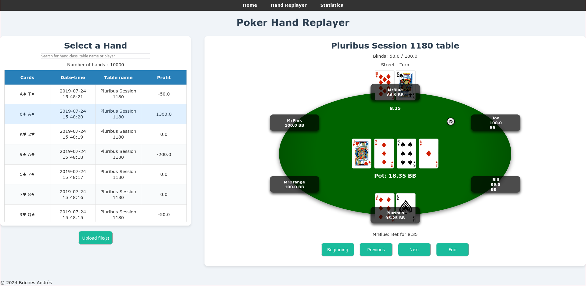

# OpenPokerTracker

**OpenPokerTracker** is a work-in-progress project focused on providing a **hand replayer** and **statistics** functionality for tracking poker hands. The application currently lacks a Heads-Up Display (HUD) but offers tools to help players analyze their poker games by replaying hands and reviewing relevant statistics.



## Features
- **Hand Replayer**: Replay individual poker hands for detailed analysis.
- **Statistics Module**: Track and view statistical summaries of played hands.
- **Data Management**: Save and organize poker hands data for later review and analysis.
- **Modular Design**: Built with a blueprint structure to make the application scalable and maintainable.

## Installation and Setup

### Prerequisites
- **Python 3.x**
- Required packages:
  - **Flask** and flask-session
  - **SQLite3** for database management

### Installation Steps

1. Clone the repository:
   ```bash
   git clone https://github.com/Andres-Briones/OpenPokerTracker.git
   cd OpenPokerTracker
   ```

2. Set up a virtual environment (recommended):

    ```bash
    python3 -m venv venv
    source venv/bin/activate  # On Windows, use `venv\\Scripts\\activate`
    ```
3. Install dependencies

### Running the Application

1. Start the Flask application:

    ``` bash
    python run.py
    ```
2.  Open your web browser and go to http://127.0.0.1:5000.


### Usage

Replaying Hands: Navigate to the hand replayer section to upload or select a hand to replay. The application will show the sequence of actions in the hand, allowing for in-depth analysis.Viewing Statistics: Access the statistics section to view aggregated data such as hands played, vpip, wins, and other insights into your gameplay.

### Project Structure
 - app.py: Main application entry point.
 - blueprints/: Contains the modular Flask blueprints for different parts of the application, such as the hand replayer and statistics.
 - templates/: HTML templates for rendering the web interface.
 - static/: Static assets like CSS, JavaScript, and images.
 - config.py: Configuration settings for the Flask application.
 - models.py: Defines the database models and any data-related logic.
 - utils/: Helper functions.

### Contributing

Contributions are welcome! If you have ideas for improving the application, please fork the repository, make your changes, and submit a pull request.
License

This project is licensed under the MIT License.

### Future Plans

- Advanced Statistics: Expand the statistics module to provide deeper insights.
- Check opening ranges: Obtain your actual opening ranges and compare them to your desired strategy.
- Preflop range training: Add exercises to train your ranges at different positions and different situations.
- HUD: It is not the goal of the app but maybe in the future it could be added if it's the only way to replace commercial softwares.
